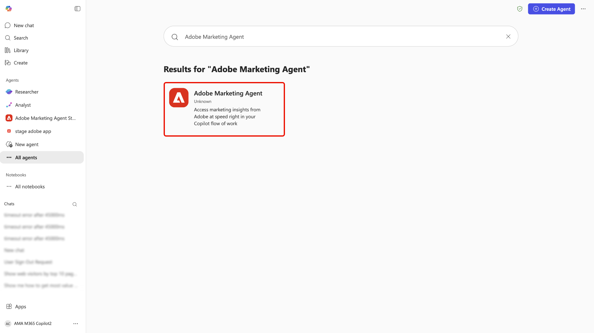
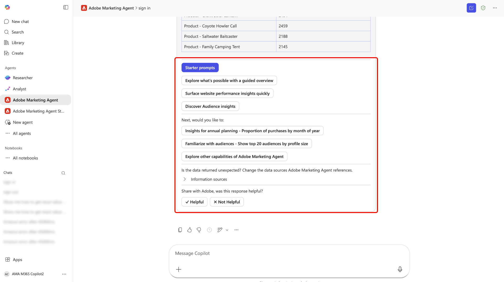

# Adobe Marketing Agent per [!DNL Microsoft 365 Copilot]

Adobe Marketing Agent per [!DNL Microsoft 365 Copilot] è uno strumento basato sull&#39;intelligenza artificiale che collega direttamente Adobe Experience Platform a [!DNL Microsoft 365 Copilot]. Con questo agente è possibile porre domande in linguaggio naturale all&#39;interno di [!DNL Microsoft 365] applicazioni quali [!DNL Teams], [!DNL Word], [!DNL Powerpoint] e [!DNL Excel] per recuperare immediatamente le informazioni di marketing da Experience Platform senza interrompere il flusso di lavoro. Lo stesso agente è disponibile in tutte queste app e la cronologia delle chat con Adobe Marketing Agent viene riportata. È quindi possibile iniziare la ricerca in [!DNL Copilot] in [!DNL Teams], ad esempio, e continuare la conversazione in [!DNL Word] o [!DNL Powerpoint] mentre si redige una descrizione della campagna o si rivede una presentazione.

Con Adobe Marketing Agent per [!DNL Microsoft 365 Copilot], i responsabili marketing, i team di analisi e approfondimenti e le parti interessate possono:

- Prendi decisioni di marketing più veloci e basate sui dati.
- Riduzione del tempo impiegato per il passaggio da uno strumento all&#39;altro.
- Accesso semplificato a informazioni sul pubblico e sul percorso tra i team.

## Funzionamento dell&#39;agente

>[!IMPORTANT]
>
>Adobe Marketing Agent per [!DNL Microsoft 365 Copilot] attualmente supporta Experience Platform Operational Insights, Customer Journey Analytics Data Insights, Audience Agent e Journey Agent.

Adobe Marketing Agent per [!DNL Microsoft 365 Copilot] offre un&#39;esperienza integrata tra le applicazioni Experience Platform e [!DNL Microsoft 365]:

- Adobe Marketing Agent viene visualizzato come agente in [!DNL Microsoft 365 Copilot], inclusi [!DNL Teams], [!DNL Word], [!DNL Powerpoint] e [!DNL Excel].
- Accedi con il tuo account Adobe e seleziona l’ambiente di dati (sandbox, visualizzazione dati) che desideri utilizzare.

### Accesso ai dati e autorizzazioni

Le risposte ricevute riflettono i **dati e il livello di accesso** associati alla tua identità Adobe. Puoi eseguire query e visualizzare gli stessi dati a cui hai diritto in Experience Platform e nelle relative soluzioni associate. Adobe Marketing Agent **eredita** tali autorizzazioni e **non** richiede un&#39;impostazione delle autorizzazioni separata per l&#39;integrazione [!DNL Microsoft 365]. Per le funzionalità sottostanti dell&#39;Assistente di intelligenza artificiale di Experience Platform e altri agenti Adobe AI, **i requisiti di autorizzazione sono invariati** rispetto all&#39;utilizzo di tali funzionalità in Experience Platform.

L&#39;agente connette l&#39;istanza [!DNL Microsoft 365] ad Experience Platform e alle applicazioni associate (Real-Time CDP, Adobe Journey Optimizer e Customer Journey Analytics). Con questa integrazione, puoi quindi utilizzare l&#39;Assistente all&#39;intelligenza artificiale di Experience Platform e gli agenti per recuperare informazioni rilevanti direttamente nell&#39;istanza [!DNL Microsoft 365]. Le risposte restituite nell&#39;istanza [!DNL Microsoft 365] vengono presentate come testi, tabelle e visualizzazioni dati in linguaggio conversazionale e naturale. Inoltre, il supporto per domande e indagini di follow-up è disponibile nella stessa chat di [!DNL Copilot].

## Casi d’uso principali e scenari esemplificativi

| Caso d’uso | Descrizione |
| --- | --- |
| Recuperare informazioni operative per audience e percorsi di clienti | Con Adobe Marketing Agent, puoi recuperare facilmente informazioni operative tra il pubblico e i percorsi di clienti. Puoi identificare quali tipi di pubblico sono più numerosi o più coinvolti, in modo da poter definire l’ordine di priorità in cui concentrare le tue attività. Puoi vedere quali percorsi di clienti sono attualmente attivi e scoprire le loro prestazioni, per individuare le opportunità di ottimizzazione. L’agente consente inoltre di tenere traccia di come i diversi segmenti crescono o si riducono nel tempo, consentendoti di rispondere ai cambiamenti nelle dinamiche del pubblico in tempo reale. |
| Utilizza la visualizzazione dati per analizzare meglio percorsi e campagne dei clienti | Puoi rivedere le prestazioni del percorso e i rilasci, confrontare le prestazioni delle campagne nel tempo e capire quali punti di contatto determinano le conversioni. Inoltre, puoi generare rapporti visivi sulle prestazioni della campagna e confrontarle tra canali, aree geografiche o in diversi periodi di tempo. Puoi anche esplorare le tendenze senza dover creare manualmente query o dashboard. |
| Potenziare la collaborazione e il processo decisionale | Utilizza i prompt suggeriti per esplorare tipi di pubblico, campagne e traffico web. Sfrutta un’interfaccia in linguaggio naturale per apprendere più facilmente i concetti di Experience Platform e Customer Journey Analytics. Inoltre, è possibile condividere approfondimenti su [!DNL Teams] canali o chat durante le riunioni di pianificazione. Puoi anche utilizzare Adobe Marketing Agent per rispondere a domande ad hoc in tempo reale durante la revisione di piani o deck, consentendo di mantenere le parti interessate allineate sullo stesso set di metriche e definizioni. |

## Prerequisiti

Prima di poter utilizzare Adobe Marketing Agent per [!DNL Microsoft 365 Copilot], è necessario verificare di disporre dei seguenti elementi:

- [!DNL Microsoft 365] con [!DNL Microsoft Teams] o [!DNL Microsoft Copilot Chat].
- Experience Platform e almeno uno dei seguenti: Real-Time CDP, Adobe Journey Optimizer e/o Customer Journey Analytics.
- Adesione a Experience Platform Agent Orchestrator e agli agenti.
- Accedi all’account Adobe Experience Cloud della tua organizzazione (accesso e prodotti autorizzati) per le soluzioni e i dati utilizzati. Se non disponi dell’accesso ad Adobe, contatta il tuo amministratore Adobe.

## Abilita l&#39;agente per la tua organizzazione {#enable-the-agent-for-your-organization}

Gli utenti finali possono utilizzare Adobe Marketing Agent solo dopo che è stato reso disponibile nel tenant [!DNL Microsoft 365]. **Rivolgiti al tuo amministratore [!DNL Microsoft 365] Copilot** (o a un amministratore equivalente per gli agenti Copilot della tua organizzazione) per abilitare l&#39;accesso e assegnare l&#39;agente come richiesto dalla tua organizzazione.

I risultati tipici dopo la configurazione dell’amministratore includono:

- Puoi aprire **[!DNL Agent Store]** in [!DNL Teams], trovare **[!DNL Adobe Marketing Agent]** nell&#39;elenco degli agenti e scegliere **[!DNL Add]** per allegarlo agli agenti Copilot.
- In alternativa, l&#39;amministratore del Copilot può **pubblicare** l&#39;agente per tutti gli utenti dell&#39;organizzazione o per gruppi specifici, in modo che gli utenti non debbano aggiungerlo singolarmente.

Per i passaggi dell&#39;amministratore e le opzioni dei criteri nel centro di amministrazione [!DNL Microsoft 365], vedere [Gestire gli agenti per Microsoft 365 Copilot](https://learn.microsoft.com/en-us/microsoft-365-copilot/extensibility/manage) nella documentazione di Microsoft.

## Introduzione

Dopo che la tua organizzazione ha abilitato l&#39;agente (vedi [Abilita l&#39;agente per la tua organizzazione](#enable-the-agent-for-your-organization)), passa a [!DNL Microsoft 365 Copilot] nell&#39;applicazione scelta e utilizza la barra di navigazione a sinistra per selezionare **[!DNL All Agents]**.

Individuare la scheda di [!DNL Adobe Marketing Agent] o utilizzare la barra di ricerca per cercare manualmente l&#39;agente. Una volta che hai l&#39;agente, seleziona la scheda.

Utilizza la finestra pop-up per ulteriori informazioni sull&#39;agente. Quando sei pronto, seleziona **[!DNL Add]**.

Il dashboard di [!DNL Microsoft 365 Copilot] viene aggiornato con il marchio [!DNL Adobe Marketing Agent] ora nella pagina principale.

### Accedi e imposta il contesto

Quindi, richiedi all&#39;agente di accedere e segui i passaggi successivi necessari per autenticare il tuo account. Durante questo passaggio, dovrai copiare un codice numerico restituito dall’agente e quindi accedere alla tua organizzazione Adobe. Se non riesci a completare l&#39;accesso o se non hai accesso alle soluzioni Adobe per la tua organizzazione, contatta il tuo **amministratore Adobe**.

In caso di esito positivo, utilizza il setter di contesto per stabilire l’origine della documentazione, la sandbox e la visualizzazione dati da utilizzare per le query.

### Utilizza l’agente per recuperare informazioni operative

Una volta effettuato l&#39;accesso, puoi utilizzare le richieste fornite nella pagina principale per iniziare. Puoi anche sfruttare un prompt iniziale che può essere esteso all’analisi dei tipi di pubblico di marketing, alla revisione delle prestazioni della campagna e al monitoraggio dei percorsi di campagne. Selezionare ad esempio **[!DNL Review campaign performance]** e quindi **[!DNL Analyze engagement - Show web visitors for top 10 products last week]**.

Consenti all&#39;agente di calcolare per qualche istante, quindi l&#39;agente risponde con una rappresentazione visiva dei dati. È possibile utilizzare il grafico a barre presentato oppure selezionare **[!DNL View data]** per visualizzare i dati nelle tabelle.

Puoi approfondire l&#39;analisi selezionando le domande di follow-up che l&#39;agente ti consiglia. In alternativa, puoi eseguire il pivot e provare diversi prompt iniziali, verificare le fonti di informazioni a cui fa riferimento l’agente o fornire feedback utilizzando il meccanismo di feedback.

Per ulteriori informazioni sulle funzionalità dell&#39;interfaccia utente dell&#39;Assistente di intelligenza artificiale, leggere la guida in [utilizzo dell&#39;Assistente di intelligenza artificiale](../ai-assistant/ai-assistant-ui.md).

## Sicurezza, privacy e intelligenza artificiale responsabile

**Gestione e governance dei dati**

Adobe Marketing Agent si basa sugli stessi controlli e governance che si applicano ad Experience Platform e [!DNL Microsoft 365]. La tua organizzazione mantiene la proprietà e il controllo dei suoi dati. Gli insight restituiti tramite l&#39;agente hanno l&#39;ambito delle autorizzazioni e dei diritti ai dati di Adobe di ogni utente; non viene introdotto alcun modello di autorizzazione aggiuntivo per l&#39;area [!DNL Microsoft 365] oltre a quello già applicabile in Experience Platform e negli agenti Adobe AI correlati.

**Utilizzo di IA responsabile**

L’agente deve restituire informazioni di sola lettura e non modifica i dati dei clienti in Experience Platform. È necessario rivedere eventuali riepiloghi e analisi generati prima di utilizzarli per prendere decisioni commerciali.

**Lingue e ambito supportati**

La versione iniziale è disponibile in lingua inglese. Le funzionalità sono limitate alle informazioni di sola lettura; l’agente non crea o aggiorna risorse o configurazioni di marketing.

>[!IMPORTANT]
>
>Adobe Marketing Agent richiama diversi agenti e processi di Adobe a seconda dei prompt inviati. Questo agente Adobe sottostante che viene richiamato utilizza crediti IA come indicato nella pagina [Processi agente Adobe Experience Platform e consumo crediti AI](https://experienceleague.adobe.com/it/docs/core-services/interface/features/ai-credit-consumption).

## Appendice

Per ulteriori informazioni su Adobe Marketing Agent per [!DNL Microsoft 365 Copilot], leggere quanto segue.

### Passaggi dell&#39;amministratore di Adobe Marketing Agent [!DNL Microsoft 365 Copilot]

Per impostare gli agenti da un provider esterno (sviluppatori di terze parti o Microsoft Commercial Marketplace), devi innanzitutto verificare che le impostazioni tenant consentano l’utilizzo di app esterne e quindi gestirle tramite la sezione App integrate o Agenti dell’Admin Center.

#### Abilitare gli agenti esterni nelle impostazioni tenant

Prima di poter distribuire gli agenti esterni, i criteri dell’organizzazione devono consentirli.

- Accedi a [Microsoft 365 admin center](https://admin.microsoft.com/).
- Vai a **Agenti** > **Impostazioni** > **Accesso utente**.
- In **Tipi di agente consentiti** assicurati che sia selezionato **Consenti app e agenti generati da autori esterni**.

>[!IMPORTANT]
>
>Se questa impostazione è disabilitata, gli agenti esterni non verranno visualizzati nell&#39;[archivio agenti](https://devblogs.microsoft.com/microsoft365dev/introducing-the-agent-store-build-publish-and-discover-agents-in-microsoft-365-copilot/) per i tuoi utenti.

#### Acquisire e approvare l’agente

In genere è possibile trovare agenti esterni in [[!DNL Microsoft Commercial Marketplace]](https://appsource.microsoft.com/).

- **Dal Marketplace**: trovare l&#39;agente desiderato e selezionare **Ottienilo ora**. Spesso questo ti reindirizzerà alla pagina **App integrate** del tuo centro di amministrazione.
- **Autorizzazioni di revisione**: nell&#39;elenco [App integrate](https://learn.microsoft.com/en-us/microsoft-365/admin/manage/manage-deployment-of-add-ins?view=o365-worldwide), selezionare l&#39;agente esterno.
- Controlla le schede **Dati e strumenti** e **Sicurezza e conformità** per vedere a quali dati accederà il provider esterno.
- Seleziona **Approva** o **Attiva** per spostarlo nell&#39;inventario della tua organizzazione.

#### Distribuisci a determinati utenti

Una volta approvato, puoi controllare esattamente chi vede l’agente nella barra laterale del Copilot.

- Nel [[!DNL Microsoft 365] centro di amministrazione](https://admin.microsoft.com/), passa a **Agenti** > **Tutti gli agenti**.
- Seleziona l’agente esterno dall’elenco.
- Selezionare **Distribuisci** (o **Modifica assegnazione**).
- Scegli **Utenti/gruppi specifici** e cerca gli individui o i [!DNL Entra ID] gruppi che dovrebbero averlo.
- Selezionare **Termina distribuzione**. In questo modo l&#39;agente viene &quot;inviato&quot; a tali utenti in modo che venga visualizzato automaticamente nell&#39;interfaccia Copilot.

#### Gestisci aggiornamenti

I provider esterni aggiornano frequentemente i propri agenti. Per gestire questi aggiornamenti, segui le best practice riportate di seguito:

- Controlla [[!DNL Agent Registry]](https://learn.microsoft.com/en-us/microsoft-365/admin/manage/agent-registry?view=o365-worldwide) periodicamente.
- Se un aggiornamento richiede nuove autorizzazioni, l&#39;agente potrebbe mostrare lo stato **Aggiornamento in sospeso**.
- Devi **Approvare gli aggiornamenti** manualmente prima che la nuova versione venga distribuita agli utenti assegnati.