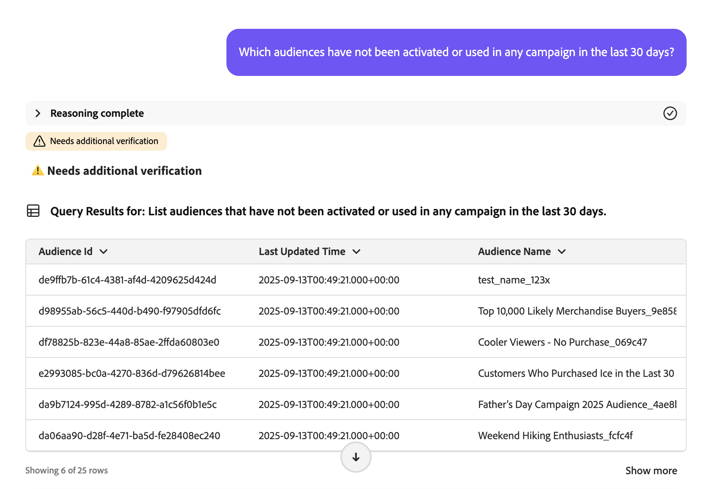
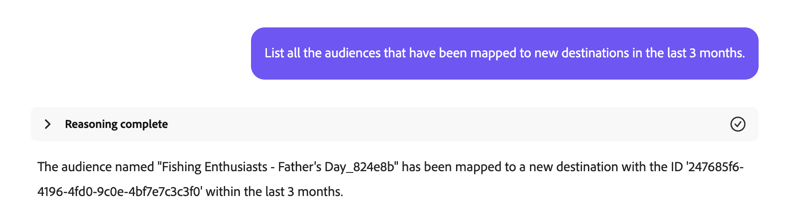
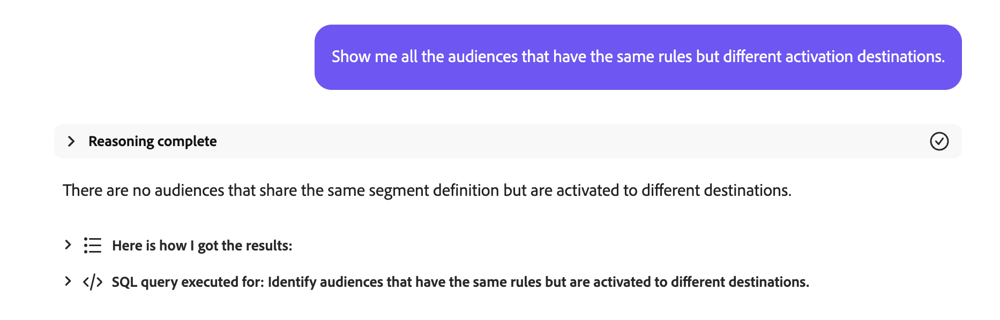
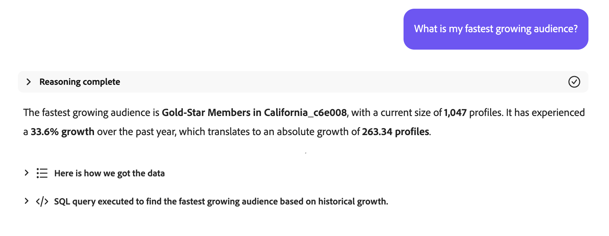

# Agente Audience

>[!AVAILABILITY]
>
>Audience Agent è disponibile per tutti i clienti che hanno accesso all’Assistente per l’intelligenza artificiale. Tuttavia, per utilizzare completamente le funzioni di Audience Agent, sono necessarie le seguenti autorizzazioni.
>
>**Visualizza segmenti**: questa autorizzazione ti consente di utilizzare Audience Agent per visualizzare approfondimenti sui tipi di pubblico direttamente nell&#39;Assistente AI.
>
>**Gestisci segmenti**: con autorizzazione consente di utilizzare Audience Agent per creare nuovi tipi di pubblico direttamente nell&#39;Assistente IA.

Audience Agent consente di visualizzare informazioni sui tipi di pubblico, tra cui il rilevamento di modifiche significative nelle dimensioni del pubblico, il rilevamento di tipi di pubblico duplicati, l’esplorazione dell’inventario dei tipi di pubblico e il recupero delle dimensioni dei tipi di pubblico.

>[!SLIDE](audience-agent-overview)

## Casi d’uso supportati

Audience Agent nell’Assistente IA supporta i seguenti casi d’uso:

- Esplorare il pubblico in modo conversazionale
   - Trovare le dimensioni dei tipi di pubblico esistenti
   - Cerca tipi di pubblico basati su attributi completi o parziali denominati
   - Rilevare tipi di pubblico duplicati
   - Scopri i campi XDM da utilizzare per definire un pubblico
- Rilevare cambiamenti significativi nelle dimensioni del pubblico
   - Questo consente di trovare tipi di pubblico che sono improvvisamente cresciuti o si sono ridotti, per analizzare meglio i potenziali cambiamenti di mercato
- Creazione di un pubblico
   - Questa abilità ti consente di creare un pubblico in base agli attributi e agli eventi forniti
   - Inoltre, questa abilità ti consente di stimare le dimensioni potenziali di un pubblico prima di crearlo, consentendoti di eseguire rapidamente l’iterazione del pubblico più efficace prima che sia pronto per essere attivato

<!-- - Find your audience size and detect significant changes in audience size
  - This lets you find audiences that have suddenly grown or shrunk, letting you better analyze potential market changes
- Detect duplicate audiences
  - This lets you reduce redundancies with your created audiences
- Find audiences based on full or partial attributes named
  - This lets you more easily navigate through your audience inventory
- Discover XDM fields you can use to define an audience
  - This skill lets you more easily identify the right fields to use in your audience based on context and relevance -->

Audience Agent non supporta **attualmente** la seguente funzionalità:

- Esplorazione del pubblico basata sugli obiettivi
   - L’esplorazione del pubblico basata sugli obiettivi consente di scoprire set di dati e profili rilevanti allineati a un obiettivo di business applicando modelli di apprendimento automatico come la propensione all’acquisto o alla conversione.

Inoltre, quando utilizzi Audience Agent, tieni presente i seguenti vincoli:

- Audience Agent richiede almeno 24 ore per elaborare i tuoi dati
   - **impossibile** ad esempio disporre di una query per la ricerca di dati nelle ultime 24 ore. Dovrai controllare almeno nelle ultime 48 ore.
- Audience Agent supporta solo i seguenti tipi di pubblico:
   - **Tipi di pubblico basati sulle persone** valutati mediante segmentazione batch
   - **Tipi di pubblico basati sull&#39;account** per i seguenti casi d&#39;uso:
      - Esplorazione del pubblico conversazionale
      - Rilevamento di pubblico duplicato

## Prompt di esempio

Negli esempi seguenti vengono illustrati i prompt di esempio e le risposte per Audience Agent.

### Esplorazione del pubblico conversazionale

Mostrami i campi per gli acquirenti benestanti.

+++ Risposta


+++

Quali tipi di pubblico non sono stati attivati o utilizzati in alcuna campagna negli ultimi 30 giorni?

+++ Risposta



+++

Elenca tutti i tipi di pubblico che sono stati mappati sulle nuove destinazioni negli ultimi 3 mesi.

+++ Risposta



+++

Quale pubblico dell’account ha la dimensione di pubblico più grande e qual è tale dimensione?

+++ Risposta


+++

### Rilevare tipi di pubblico duplicati

Ho tipi di pubblico con descrizioni identiche o simili?

+++ Risposta


+++

Identifica i tipi di pubblico che hanno le stesse regole ma nomi diversi.

+++ Risposta


+++

Mostra tutti i tipi di pubblico che hanno le stesse regole ma destinazioni di attivazione diverse.

+++ Risposta



+++

Identifica i tipi di pubblico dell’account che hanno le stesse regole ma nomi diversi.

+++ Risposta


+++

### Recupera dimensione pubblico

Qual è la dimensione attuale del mio pubblico &quot;Membri Gold-star in California_f153e1&quot;?

+++ Risposta


+++

Qual è il mio pubblico più grande?

+++ Risposta


+++

### Rilevare cambiamenti significativi nelle dimensioni del pubblico

Quali tipi di pubblico sono aumentati di oltre il 20% nell’ultima settimana?

+++ Risposta


+++

Quali tipi di pubblico sono diminuiti di oltre il 10% nell’ultimo mese?

+++ Risposta


+++

Qual è il mio pubblico in più rapida crescita?

+++ Risposta



+++

### Creazione di un pubblico

>[!AVAILABILITY]
>
>Puoi utilizzare l’abilità Crea pubblico solo se fai parte del programma Agent Orchestrator Explorer. Per ulteriori informazioni, contatta l’Assistenza clienti di Adobe.

Quando crei un pubblico con Audience Agent, l’Assistente AI ti guiderà attraverso un piano. Ad esempio, puoi chiedere di &quot;Creare un pubblico composto da persone che vivono in California&quot;. Assistente IA elenca quindi il piano che verrà intrapreso per creare il pubblico.

+++ Risposta


+++

Il piano si articola in tre fasi:

1. [Identificare le caratteristiche del pubblico](#identify)
2. [Stimare la dimensione del pubblico](#estimate)
3. [Creare e mantenere un nuovo pubblico](#create)

#### Identificare le caratteristiche del pubblico {#identify}

{align="center" width="80%"}

Dopo aver accettato il piano, l’Assistente AI acquisirà le caratteristiche del pubblico in base alla query iniziale.

+++ Risposta


Per questa query, l’Assistente AI genera il Profile Query Language (PQL) rilevante che cercherà le persone che vivono in California. In questo caso d’uso, la query PQL sarà simile alla seguente:

```sql
homeAddress.state.equals("California", false)
```

Per ulteriori informazioni su PQL, leggere la [panoramica di PQL](https://experienceleague.adobe.com/it/docs/experience-platform/segmentation/pql/overview).

+++

Se la definizione del pubblico dell’Assistente AI è corretta, puoi approvare e passare al passaggio successivo.

#### Stimare la dimensione del pubblico {#estimate}

{align="center" width="80%"}

Dopo aver approvato le caratteristiche del pubblico identificato, AI Assistant stimerà le dimensioni del pubblico potenziale e i dettagli di definizione del pubblico.

+++ Risposta


+++

Se la dimensione stimata è corretta, puoi approvare e passare al passaggio successivo.

#### Creare e mantenere un nuovo pubblico {#create}

{align="center" width="80%"}

Infine, se le caratteristiche e le dimensioni del pubblico sono corrette, puoi approvare o rifiutare la creazione del pubblico.

+++ Risposta

Innanzitutto, puoi esaminare il pubblico proposto tramite la griglia dati fornita.


Se il pubblico è corretto, puoi accettare la proposta selezionando **[!UICONTROL Crea]** per completare la creazione del pubblico.


+++

Il pubblico viene ora creato.

{align="center" width="80%"}

## Passaggi successivi

Dopo aver letto questa guida, avrai una migliore comprensione di Audience Agent e delle funzioni che supporta. Per ulteriori informazioni sugli agenti in Adobe Experience Platform, leggere la [panoramica di Agent Orchestrator](./agent-orchestrator.md).

