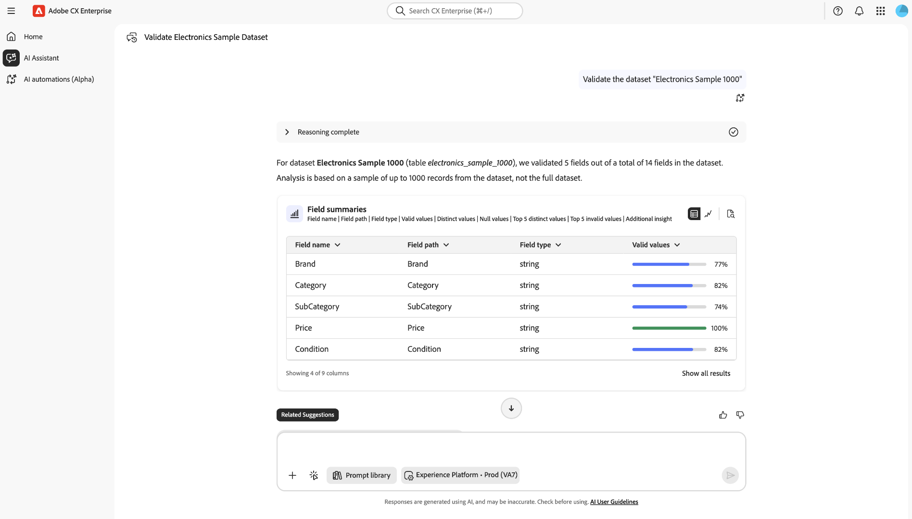
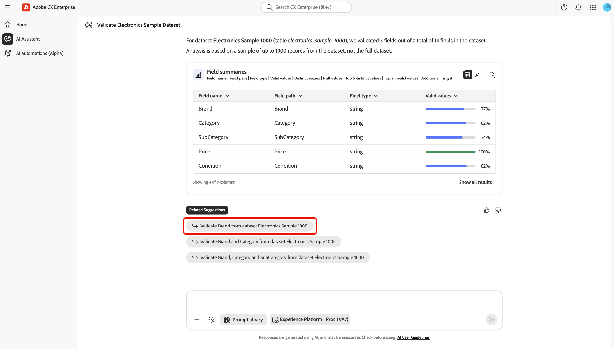

# Convalidare i dati in AI Assistant

Puoi utilizzare l’Assistente AI per convalidare la qualità dei dati dei set di dati di Adobe Experience Platform. Grazie alla tecnologia di Agent Orchestrator, la funzionalità di convalida dei dati può eseguire convalide statistiche e semantiche sui set di dati, analizzare i campi dei set di dati, identificare i problemi di qualità dei dati e restituire riepiloghi in linguaggio naturale con informazioni fruibili. I data engineer, gli analisti e gli amministratori di dati possono utilizzare questa funzionalità tramite l’Assistente all’intelligenza artificiale per eseguire valutazioni rapide della qualità dei dati senza scrivere query SQL o navigare in gerarchie di schemi complesse.

Con la convalida dei dati basata su Agent Orchestrator in AI Assistant, puoi:

- Colmare le lacune essenziali sia nel processo di onboarding che nella diagnostica quotidiana.
- Riduci il controllo qualità manuale sui set di dati.
- Accelerare il time-to-value per i clienti.

Leggi questa documentazione per scoprire come convalidare i dati in AI Assistant.

>[!NOTE]
>
>L’Assistente AI è l’interfaccia di conversazione per questo flusso di lavoro. Agent Orchestrator esegue il ragionamento e coordina i passaggi di convalida dietro le quinte.

## Casi d’uso

| Caso d’uso | Descrizione |
| --- | --- |
| Nuova implementazione | In questi scenari, puoi convalidare i campi di identità chiave ed evento per confermare che i formati e le percentuali nulle siano integri. |
| Problema di mappatura sospetto | In questi scenari, puoi convalidare un campo e ispezionare i valori principali e gli invalidamenti per verificare che corrisponda alla semantica prevista. |
| Gestione continua dei dati | In questi scenari, puoi eseguire settimanalmente la convalida dei set di dati sui set di dati critici per rilevare tempestivamente le regressioni. |

## Guida all’interfaccia utente

Utilizza **AI Assistant** in Adobe CX Enterprise per convalidare i dati. L’Assistente AI è l’interfaccia di conversazione, mentre Agent Orchestrator coordina il flusso di lavoro di convalida dietro le quinte. I seguenti passaggi seguono le schermate principali visualizzate.

### Avvia convalida

Nel menu di navigazione a sinistra, selezionare **[!UICONTROL Assistente AI]**. Quindi, utilizza il selettore dell&#39;ambiente e scegli l&#39;organizzazione Experience Platform o la sandbox in cui si trova il set di dati (ad esempio, **[!UICONTROL Experience Platform - Prod]**). Nel campo prompt, digita una richiesta di convalida (ad esempio, chiedi di convalidare un set di dati per nome). Seleziona **[!UICONTROL Invia]** per inviare la richiesta.

>[!TIP]
>
>È consigliabile anteporre ai nomi dei set di dati la parola &quot;set di dati&quot; durante l’invio di una query all’Assistente IA. Ad esempio, la query deve essere &quot;Validate the dataset Electronics Sample 1000&quot; invece di &quot;Validate Electronics Sample 1000&quot;.

### Leggi il riepilogo dei set di dati e la tabella dei campi

Consenti a Agent Orchestrator di completare l&#39;esecuzione (**Motivazione completata**). Al termine dell’esecuzione, leggi il riepilogo per il nome del set di dati, quanti campi sono stati convalidati e la dimensione del campione (in genere fino a circa 1.000 righe).

Utilizza i **[!UICONTROL Riepiloghi campo]** per rivedere il percorso, il tipo e i valori validi di ogni campo (incluso l&#39;indicatore di validità). È inoltre possibile utilizzare le icone di tabella, grafico o documento sulla scheda per modificare la modalità di visualizzazione dei risultati, se disponibili.

Selezionare **[!UICONTROL Mostra tutti i risultati]** quando sono necessarie colonne o righe aggiuntive oltre la prima visualizzazione.

### Operazioni in visualizzazione divisa

Nella visualizzazione espansa, utilizza il layout diviso: statistiche dettagliate e narrazioni su un lato e il grafico sull’altro.

- Sul lato narrativo, controlla la validità, i valori distinti, le percentuali di valori nulli, i valori distinti principali ed eventuali messaggi con valore non valido.
- Dal lato della visualizzazione, utilizza il grafico per una lettura rapida dei valori validi e non validi nell’esempio.

Utilizza **[!UICONTROL Suggerimenti correlati]** o il campo del prompt nella parte inferiore per convalidare un altro campo, rieseguire il set di dati o continuare la conversazione.

### Utilizzare un suggerimento correlato per un follow-up

Dopo una risposta, trova **[!UICONTROL Suggerimenti correlati]** sotto la conversazione. Seleziona un suggerimento (ad esempio, convalida un campo specifico sullo stesso set di dati) per caricarlo nel campo del prompt. Se necessario, regola il testo, conferma l&#39;ambiente, quindi seleziona **[!UICONTROL Invia]** per eseguire il completamento.

### Convalida a livello di campo

Apri una scheda **[!UICONTROL Risultati convalida]** a livello di campo (ad esempio, dopo la convalida di un singolo campo). Utilizzare i controlli di visualizzazione per passare a **Grafico** (o altra visualizzazione) quando si desidera un riepilogo visivo anziché una tabella. Durante questo passaggio è possibile selezionare **[!UICONTROL Proprietà]** per visualizzare ulteriori informazioni sul campo.

Selezionare **[!UICONTROL Mostra in visualizzazione espansa]** per aprire una visualizzazione più ampia e dettagliata della convalida del campo.

La visualizzazione espansa consente di visualizzare un elenco dettagliato dell&#39;intero campo, basato su un campione di un massimo di 1000 record per il campo specificato. È possibile utilizzare questa funzionalità per recuperare informazioni sui valori validi, distinti e nulli.

## Funzionamento della convalida

Quando avvii una convalida in AI Assistant, Agent Orchestrator analizza un campione rappresentativo del set di dati, in genere le ~1.000 righe più recenti, anziché elaborare l’intera cronologia del set di dati. Il processo è rigorosamente di sola lettura e assicura che dati, schemi e mappature rimangano invariati. I risultati della convalida sono coerenti indipendentemente da come i dati vengono inseriti in Experience Platform, sia tramite origini, streaming, caricamenti di file, preparazione dati o altri metodi di acquisizione. I risultati fungono da controlli indicativi per aiutarti a identificare rapidamente i pattern di qualità dei dati o i potenziali problemi, consentendoti di intraprendere ulteriori azioni (ad esempio esplorando con Query Service) se necessario. Questo approccio basato su Agent Orchestrator consente valutazioni rapide senza interrompere l’acquisizione dei dati o influire sui carichi di lavoro di produzione.

## Risultati della convalida

Per ogni campo convalidato, l’Assistente IA visualizza i risultati generati dal flusso di lavoro di convalida, tra cui:

**Statistiche di base**

- Numero totale di righe utilizzato per il campione
- nullCount (e facoltativamente % null)
- uniqueCount (se disponibile)
- Primi valori univoci (ad esempio, primi 10) e relative frequenze

**Convalida semantica**

- Elenco di **valori non validi sospetti**
- Per ogni valore non valido, una **spiegazione** (ad esempio, &quot;formato e-mail non valido&quot;, &quot;timestamp al di fuori dell&#39;intervallo previsto&quot;)

**Riepilogo lingua naturale**

- Breve riepilogo della qualità del campo
- Azioni successive consigliate, come &quot;rivedere la mappatura per il campo X&quot;, &quot;considerare l’eliminazione del campo Y a causa di un tasso nullo elevato&quot; o &quot;stringere la convalida per il formato e-mail&quot;.

| Formato | Output di esempio |
| --- | --- |
| Completezza | `nullCount = 9,532 (95.3%)` |
| Unicità | `uniqueCount = 3` |
| Valori principali | `"True" (255), "False" (243)` |
| Valori iniziali | `"abc@, reason: "not a valid email address"` |

## Tipi di convalida

Con l’Assistente IA è possibile eseguire due tipi di convalida principali:

- **Convalida campo**: convalida un campo specifico in un set di dati.
- **Convalida set di dati**: convalida di un massimo di cinque (5) campi in un set di dati.

>[!BEGINTABS]

>[!TAB Convalida campo]

Utilizza la convalida dei campi nell’Assistente IA per convalidare un campo specifico in un determinato set di dati. Questa abilità di convalida fornisce quanto segue:

- Numero nullo e numero di valori univoci.
- Primi valori univoci e le relative frequenze corrispondenti.
- Convalida semantica basata sull’intelligenza artificiale (la capacità di rilevare valori non validi in base ai metadati disponibili e ai valori effettivi dei dati).

Di seguito sono riportati alcuni esempi di prompt per la convalida del campo:

- Convalida il campo e-mail nel set di dati Customers_2024.
- Convalida lo stato del campo per il set di dati customer_events_2024.
- Convalida il campo person.address.city per il set di dati dei clienti.

>[!TAB Convalida set di dati]

Utilizza la convalida dei set di dati nell’Assistente IA per convalidare interi set di dati, riepilogando la qualità complessiva e i problemi chiave. Anche se puoi fornire questi campi in modo esplicito, Agent Orchestrator può anche analizzare il set di dati e determinare automaticamente i campi più rilevanti. Questa abilità fornisce lo stesso tipo di informazioni della convalida del campo, ma in diversi campi di destinazione. Puoi convalidare fino a cinque campi in un dato set di dati.

Di seguito sono riportati alcuni esempi di prompt per la convalida del set di dati:

- Convalida il set di dati di Customer Data 2024.
- Convalida campi e-mail, telefono per Customers_2024.
- Riepilogare nome, cognome, data di nascita per i dati del cliente.
- Riepiloga il set di dati 693012a4b8c98b09cea350bc.

>[!ENDTABS]

## Controlli eseguiti dalla convalida dei dati

Per ogni campo e set di dati vengono eseguiti i seguenti tipi di convalida:

- **Controlli di completezza**: conteggi e percentuali nulli/mancanti.
- **Controlli di distribuzione**: primi valori univoci e relative distribuzioni, rilevamento ad alta cardinalità.
- **Controlli semantici rispetto allo schema**: utilizza il nome, il tipo e la descrizione del campo XDM per dedurre l&#39;aspetto di &quot;valido&quot;, quindi contrassegna le anomalie.
- **Controlli in base al tipo di dati** (se applicabile):
   - E-mail: formato e plausibilità del dominio
   - Telefono: preparazione al formato (ad esempio, E.164)
   - Date/marche temporali: integrità del formato di base (ad esempio, ISO-8601)
- **Controlli relativi all&#39;identità** (futuri/estesi): univocità dei campi di identità candidati o delle chiavi composite.

Questi controlli combinano le statistiche deterministiche con la convalida semantica assistita da LLM per rilevare i valori che &quot;sembrano errati&quot; anche quando tecnicamente corrispondono allo schema.

## Limitazioni

Prima di convalidare i dati, è importante conoscere alcune limitazioni fondamentali. Questi vincoli hanno lo scopo di bilanciare le prestazioni con le funzionalità e aiuteranno a impostare le aspettative per i tipi di analisi e di approfondimenti che puoi aspettarti.

- **Solo campionamento**: la convalida funziona su un campione del set di dati (in genere le ultime ~1.000 righe) anziché sull&#39;elaborazione dell&#39;intero set di dati. Le scansioni complete dei set di dati non sono disponibili.
- **Limite conteggio campi**: durante la convalida di un set di dati, l&#39;agente analizza fino a cinque campi per richiesta. Puoi specificare questi campi o consentire all’agente di selezionarli automaticamente.
- **Semantica probabilistica**: il rilevamento di valori non validi si basa in parte sull&#39;inferenza basata su LLM, che può occasionalmente perdere errori sottili o valori limite del flag.
- **Operazione di sola lettura**: l&#39;agente non apporta alcuna modifica ai dati o al relativo schema. Fornisce informazioni approfondite ed evidenzia potenziali problemi, ma non esegue correzioni automatizzate.

Se le tue esigenze di convalida sono più esaustive o richiedono l’applicazione di una logica di business complessa, puoi integrare i risultati mostrati nell’Assistente AI con strumenti aggiuntivi come le convalide di Query Service o Preparazione dati.
