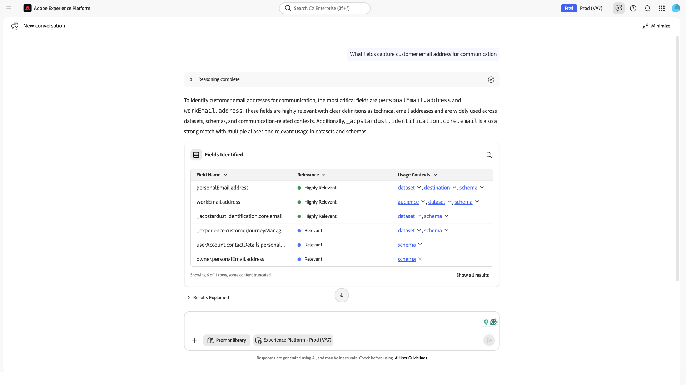
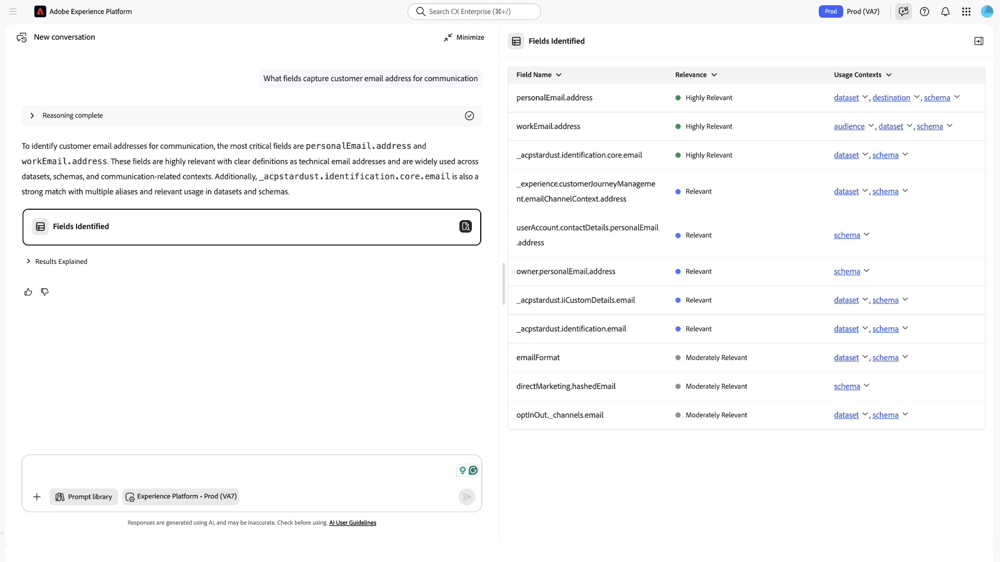

# Agente di individuazione campi

Quando si creano tipi di pubblico o si creano dati di onboarding in Adobe Experience Platform, spesso per identificare il campo XDM corretto per un concetto aziendale è necessario sfogliare manualmente gli schemi o sapere in anticipo esattamente come viene denominato un campo. Campi diversi possono rappresentare lo stesso concetto con nomi diversi (ad esempio, stato, regione e posizione) e la scelta di quello sbagliato introduce errori nei flussi di lavoro a valle.

L’agente di individuazione campi è un agente basato sull’intelligenza artificiale in Adobe Experience Platform che consente di trovare, valutare e selezionare campi XDM utilizzando query in linguaggio naturale nell’Assistente all’intelligenza artificiale. Descrivi cosa stai cercando in un linguaggio semplice: un concetto di business, un obiettivo di flusso di lavoro o un nome di campo specifico; l’agente restituisce i suggerimenti di campi classificati con un contesto di supporto.

L’agente di individuazione campi viene richiamato automaticamente in background nell’Assistente IA quando altri agenti Experience Platform devono risolvere riferimenti a campi o entità. In questi casi, opera in background per migliorare la precisione dell’agente con cui stai lavorando. Quando hai bisogno dell’individuazione dei campi per il tuo lavoro, scrivi un esplicito prompt di ricerca dei campi in Assistente IA. L&#39;agente di individuazione campi fa emergere solo le informazioni sui campi. Non modifica schemi, set di dati o tipi di pubblico e rispetta i controlli di accesso e il contesto sandbox esistenti.

## Quando utilizzare questo {#when-to-use-this}

Utilizza l’agente di individuazione campi in modo esplicito nell’Assistente AI quando sono necessari suggerimenti di campo con classificazione, valori di esempio e contesto di utilizzo per una mappatura, segmentazione o query. Viene utilizzato implicitamente quando un altro agente Experience Platform lo richiama in background per risolvere riferimenti a campi o entità. In questi casi, rimani nel flusso di lavoro di quell’agente e non invii un messaggio di ricerca campo separato.

## Prerequisiti {#prerequisites}

Per utilizzare l&#39;agente di individuazione campi, verificare di disporre dei seguenti elementi:

- Accesso a Adobe Experience Platform e Assistente AI
- L’organizzazione e la sandbox corrette
- Accesso agli schemi e ai set di dati che si intende interrogare

Una conoscenza di base degli schemi XDM e del modo in cui i campi vengono utilizzati nella segmentazione o nei flussi di lavoro dei dati può aiutarti a interpretare i risultati in modo più efficace. Per ulteriori informazioni, vedere la [panoramica XDM](https://experienceleague.adobe.com/it/docs/experience-platform/xdm/home) e la [documentazione dell&#39;editor di schemi](https://experienceleague.adobe.com/it/docs/experience-platform/xdm/tutorials/create-schema-ui).

Per istruzioni su come abilitare l&#39;accesso all&#39;Assistente AI e concedere le autorizzazioni necessarie, consulta la [guida all&#39;accesso di Agent Orchestrator](./agent-orchestrator.md#access).

## Funzioni dell&#39;agente di individuazione campi {#field-discovery-agent-functions}

L&#39;agente di individuazione campi elabora la query e restituisce uno dei tre tipi di output in base all&#39;intento. Queste funzioni riflettono il modo in cui l’agente interpreta la query; non vengono selezionate. L’agente determina automaticamente il tipo di risposta appropriato in base a ciò che descrivi.

| Funzione | Descrizione | Output previsto |
| --- | --- | --- |
| **Identificazione** | Identifica i campi XDM che corrispondono semanticamente a un concetto o un attributo di business descritto nel linguaggio naturale. | Elenco di campi candidati con etichette di rilevanza, percorsi di campo e collegamenti ai contesti di utilizzo. |
| **Consiglio** | Consiglia i campi XDM in base a un obiettivo del flusso di lavoro o a un caso d’uso descritto, ad esempio la creazione di un segmento di pubblico o la modellazione di un attributo comportamentale. | Un elenco prioritario di campi relativi all’obiettivo dichiarato, con contesto di pertinenza per ciascuno di essi. |
| **Arricchimento** | Restituisce il contesto dettagliato per un campo specifico, inclusi i valori di esempio, la posizione dello schema e la posizione in cui il campo viene utilizzato tra set di dati, tipi di pubblico e destinazioni. | Dettagli del campo, inclusi i valori di esempio, il percorso dello schema, i set di dati associati e l’utilizzo del pubblico o della destinazione. |

## Funzionamento di Field Discovery Agent {#how-field-discovery-agent-works}

Ad alto livello, l’agente interpreta l’intento, cerca i dati disponibili e classifica i risultati in base alla rilevanza. La modalità di formulazione della query influisce direttamente su ogni fase, il che a sua volta influisce sulla qualità dei risultati.

Quando si invia una query nell&#39;Assistente all&#39;analisi dei campi, l&#39;agente di individuazione campi elabora la richiesta in tre fasi:

| Fase | Descrizione |
|------|-------------|
| **Interpretazione intento** | L’agente legge l’input del linguaggio naturale e identifica il concetto o l’obiettivo sottostante. Ad esempio, una query su &quot;people in California&quot; viene interpretata come una richiesta di attributo geografico, non come una corrispondenza di stringa letterale. L’agente mappa la formulazione su concetti equivalenti dal punto di vista semantico che possono comparire con nomi diversi nei vari schemi. |
| **Ambito di ricerca** | L’agente esegue ricerche negli schemi XDM, nei set di dati e nei metadati dei campi disponibili nell’organizzazione IMS e nella sandbox correnti. Vengono presi in considerazione i nomi dei campi, i nomi visualizzati, le descrizioni e le associazioni di utilizzo per trovare i candidati in linea con l&#39;intento. |
| **Classifica** | L’agente classifica i risultati in base alla rilevanza semantica, ossia alla corrispondenza tra un campo e l’intento dichiarato, oltre a segnali quali la completezza dei metadati e l’utilizzo dei campi nell’ecosistema di dati. I campi con nomi descrittivi, metadati compilati e utilizzo confermato nei set di dati attivi hanno un rango superiore rispetto ai campi presenti solo in una definizione di schema. L&#39;agente non espone i pesi specifici assegnati ai singoli segnali. |

## Comprendere i risultati {#understand-your-results}

L&#39;agente di individuazione campi restituisce un set di risultati strutturati per ogni query. Comprendere i componenti di un risultato consente di valutare i campi candidati e di agire in modo affidabile, senza ulteriori tentativi ed errori.

Considera un campo pronto all&#39;uso quando la relativa etichetta **[!UICONTROL Rilevanza]** è **[!UICONTROL Altamente rilevante]**, i valori di esempio corrispondono ai dati previsti (se disponibili) e i relativi **[!UICONTROL Contesti di utilizzo]** sono allineati con le modalità di utilizzo previste. Se i risultati sono solo **[!UICONTROL moderatamente rilevanti]** o **[!UICONTROL rilevanti]**, i valori di esempio non corrispondono alle tue aspettative o il contesto di utilizzo è limitato, perfeziona la query e controlla un nuovo set di risultati prima di procedere.

### Etichette di rilevanza

L&#39;agente di individuazione campi assegna un&#39;etichetta di rilevanza nella colonna **[!UICONTROL Rilevanza]** del pannello **[!UICONTROL Campi identificati]** per ogni risultato di campo, indicando la corrispondenza tra il campo e la query.

- **[!UICONTROL Estremamente rilevante]**: il campo corrisponde fortemente al concetto dichiarato in base al nome, ai metadati e ai segnali di utilizzo. Conferma il percorso del campo e rivedi i valori di esempio per verificare che contenga i dati previsti.
- **[!UICONTROL Moderatamente rilevante]**: il campo ha una parziale sovrapposizione semantica con la query, ma può differire per ambito, tipo di dati o specificità. Rivedi i valori di esempio e il contesto di utilizzo per determinare se soddisfa le tue esigenze prima di selezionarlo.
- **[!UICONTROL Rilevante]** — Il campo corrisponde parzialmente alla query. Può condividere la sovrapposizione semantica ma differire per ambito, specificità o tipo di dati. Rivedi i valori di esempio e il contesto di utilizzo prima di decidere se utilizzarlo.

Se tutti i risultati sono etichettati **[!UICONTROL Moderatamente rilevanti]** o **[!UICONTROL Rilevanti]** anziché **[!UICONTROL Altamente rilevanti]**, la query potrebbe essere troppo ampia o utilizzare una terminologia che non corrisponde ai metadati dello schema. Definisci il prompt con termini più specifici per lingua o dominio che riflettano la modalità di denominazione dei campi.

### Valori di esempio

Accanto a ogni suggerimento di campo, l&#39;agente di individuazione campi visualizza valori di esempio tratti dai dati del campo nella sandbox. I valori di esempio consentono di verificare che un campo contenga il tipo di dati previsto prima di selezionarlo.

>[!IMPORTANT]
>
>I valori di esempio possono contenere dati PII. Non condividerli all’esterno di flussi di lavoro interni sicuri.

I valori di esempio sono visibili solo per i campi all’interno delle autorizzazioni di accesso al set di dati. Per informazioni sulla governance dei dati e sulle restrizioni di utilizzo in Experience Platform, consulta la [Panoramica sulla governance dei dati](https://experienceleague.adobe.com/it/docs/experience-platform/data-governance/home).

Se non vengono visualizzati valori di esempio per un campo, il campo potrebbe essere vuoto nella sandbox corrente o le autorizzazioni potrebbero non includere l’accesso al relativo set di dati sottostante. Anche i campi con cardinalità elevata (come i campi Identificatore o UUID) potrebbero non restituire valori di esempio rappresentativi. I valori di esempio sono aggregati e basati sulla frequenza e non sono tracciabili per i singoli profili.

### Contesto di utilizzo

Ogni risultato di campo include il contesto di utilizzo che mostra dove viene visualizzato il campo nell’ecosistema di dati:

**Pubblico → Set Di Dati → Schema Di → Destinazione**

Un campo utilizzato in un pubblico pubblicato, visualizzato in un set di dati attivo, mappato a una destinazione live e definito in uno schema che ha dimostrato l’utilizzo reale nell’ambiente. Questo distingue i campi che si basano attivamente da quelli che esistono solo in una definizione di schema ma che non sono stati utilizzati nella pratica. Utilizza questo segnale insieme all’etichetta di rilevanza e ai valori di esempio per effettuare una selezione del campo più informata.

### Risultati in Assistente IA

L&#39;agente di individuazione campi restituisce i risultati in un pannello **[!UICONTROL Campi identificati]** nella risposta dell&#39;Assistente IA. Nel pannello viene visualizzata una tabella con tre colonne:

- **[!UICONTROL Nome campo]**: il percorso XDM del campo candidato.
- **[!UICONTROL Rilevanza]** — Etichetta di rilevanza assegnata al campo (**[!UICONTROL Altamente rilevante]**, **[!UICONTROL Moderatamente rilevante]** o **[!UICONTROL Rilevante]**)
- **[!UICONTROL Contesti di utilizzo]**: collegamenti che indicano la posizione del campo nell&#39;ecosistema di dati. Seleziona **[!UICONTROL pubblico]**, **[!UICONTROL set di dati]**, **[!UICONTROL destinazione]** o **[!UICONTROL schema]** per aprire un pannello laterale che mostra dove viene utilizzato il campo.

Una sezione **[!UICONTROL Risultati spiegati]** viene visualizzata sotto la tabella **[!UICONTROL Campi identificati]** e fornisce ulteriore contesto a livello di campo, incluse spiegazioni e dettagli di supporto per ogni risultato. Per informazioni su come navigare nell&#39;interfaccia dell&#39;Assistente di intelligenza artificiale, vedere la [Guida dell&#39;interfaccia utente dell&#39;Assistente di intelligenza artificiale](../ai-assistant/ai-assistant-ui.md).

## Usa agente di individuazione campi {#use-field-discovery-agent}

L&#39;utente interagisce con l&#39;agente di individuazione campi tramite l&#39;Assistente IA utilizzando il linguaggio naturale. L&#39;agente richiede una dichiarazione di intenti chiara: una query vaga o troppo breve produce risultati di qualità inferiore o potrebbe non richiamare l&#39;agente di individuazione campi.

Per l&#39;individuazione esplicita dei campi, segui questo flusso di lavoro: identifica l&#39;attributo o il problema di mappatura, invia una query di ricerca dei campi, rivedi i risultati classificati e il contesto di utilizzo nel pannello **[!UICONTROL Campi identificati]**, seleziona il percorso **[!UICONTROL Nome campo]** che corrisponde al tuo intento e applica tale percorso XDM in Segment Builder, Query Service o un altro flusso di lavoro.

Per utilizzare l&#39;agente di individuazione campi:

1. Passa a **[!UICONTROL Assistente AI]** da qualsiasi applicazione Experience Platform abilitata. Viene visualizzata l&#39;area di lavoro **[!UICONTROL Assistente IA]**.
2. Dichiara esplicitamente l’intento nel campo di input. Descrivi il concetto, l’obiettivo o la caratteristica di campo che stai cercando. Ad esempio: *&quot;Trova i campi relativi allo stato di rinuncia e-mail del cliente.&quot;*
3. Rivedi i risultati classificati nel pannello **[!UICONTROL Campi identificati]**. Ogni riga include un&#39;etichetta di rilevanza e un percorso di campo XDM nella colonna **[!UICONTROL Nome campo]**.
4. Seleziona **[!UICONTROL pubblico]**, **[!UICONTROL set di dati]**, **[!UICONTROL destinazione]** o **[!UICONTROL schema]** nella colonna **[!UICONTROL Contesti di utilizzo]** per aprire un pannello laterale che mostra dove viene utilizzato il campo. Per ulteriori informazioni sul contesto a livello di campo, vedere la sezione **[!UICONTROL Risultati spiegati]** sotto la tabella dei risultati.

   

5. Utilizza il percorso **[!UICONTROL Nome campo]** negli strumenti a valle come Segment Builder, Query Service o flussi di lavoro di acquisizione dati, a seconda del caso d&#39;uso. L&#39;agente di individuazione campi fornisce il riferimento al campo, ma non lo inserisce in altri strumenti.

Se necessario, selezionare il menu a discesa **[!UICONTROL Motivazione completata]** sopra la risposta per confermare che l&#39;agente di individuazione campi ha gestito la richiesta. Nel menu a discesa vengono visualizzati i dettagli del ragionamento che indicano quale agente è stato chiamato.

>[!NOTE]
>
>Se il pannello di ragionamento non indica l&#39;agente di individuazione campi, è possibile che la query non abbia contenuto un chiaro intento di individuazione campi. Ripeti la query con un linguaggio esplicito per la ricerca dei campi e invia di nuovo. Consulta [Risoluzione dei problemi](#troubleshooting) per i problemi comuni relativi alle chiamate.

Per informazioni sull&#39;interfaccia dell&#39;Assistente IA, vedere la [Guida dell&#39;interfaccia utente dell&#39;Assistente IA](../ai-assistant/ai-assistant-ui.md).

## Casi d’uso supportati {#supported-use-cases}

Le sezioni seguenti descrivono ciascuna delle tre funzioni di Field Discovery Agent con scenari rappresentativi e prompt di esempio. I risultati includono etichette di rilevanza e contesto di utilizzo per facilitare la valutazione dei campi. Per l&#39;interpretazione dei risultati, vedere [Comprendere i risultati](#understand-your-results). L&#39;agente di individuazione campi restituisce solo le informazioni del campo, non crea tipi di pubblico, non esegue query o invia dati ad altri strumenti. Dopo aver identificato un campo, leggi il relativo percorso XDM dalla colonna **[!UICONTROL Nome campo]** e utilizzalo nel flusso di lavoro a valle.

### Identificare i campi per un concetto aziendale

Quando si descrive un concetto o un attributo di dati specifico, l&#39;agente di individuazione campi restituisce un elenco di campi con una classificazione corrispondente alla descrizione.

> &quot;Quali campi rappresentano lo stato o la provincia di origine di un cliente?&quot;
> &quot;Trova i campi relativi alla data della transazione di acquisto.&quot;
> &quot;Quali campi contengono informazioni sul consenso al marketing via e-mail?&quot;

La risposta elenca i campi candidati con la relativa etichetta di rilevanza e il percorso XDM nel pannello **[!UICONTROL Campi identificati]**. I campi con etichetta **[!UICONTROL Molto rilevanti]** corrispondono maggiormente al concetto dichiarato. Se i primi risultati sono etichettati **[!UICONTROL Moderatamente rilevanti]** o **[!UICONTROL Rilevanti]** anziché **[!UICONTROL Altamente rilevanti]**, perfeziona la query utilizzando una terminologia più specifica o un contesto a livello di campo.

### Ottenere consigli sui campi per un caso d’uso

Quando descrivi un obiettivo o un caso di utilizzo del flusso di lavoro, ad esempio la creazione di un segmento, l’onboarding di un set di dati o la preparazione di una query, l’agente di individuazione campi consiglia di allineare i campi a tale obiettivo, dando priorità in base alla rilevanza.

> &quot;Voglio creare un pubblico di clienti di alto valore. Quali campi dovrei usare?&quot;
> &quot;Consiglia i campi per modellare la propensione all’acquisto.&quot;
> &quot;Quali campi devo includere durante l’onboarding di un set di dati per transazioni di vendita al dettaglio?&quot;

La risposta restituisce un elenco con priorità di campi con contesto di rilevanza. Esamina il contesto di utilizzo per ogni campo consigliato per verificarne l’utilizzo attivo nell’ambiente.

### Arricchire il contesto del campo

Quando si richiede informazioni su un campo specifico per nome o percorso, l&#39;agente di individuazione campi restituisce il contesto dettagliato per tale campo, inclusi i valori di esempio, la posizione dello schema e l&#39;utilizzo tra set di dati, tipi di pubblico e destinazioni.

> &quot;Ulteriori informazioni sul campo `person.name.lastName`.&quot;
> &quot;Quali valori di esempio esistono per `homeAddress.stateProvince`?&quot;
> &quot;Dov&#39;è il campo `commerce.purchases.value` utilizzato nei miei set di dati e tipi di pubblico?&quot;

La risposta restituisce i valori di esempio del campo, la posizione dello schema, i set di dati associati e tutti i tipi di pubblico o le destinazioni in cui viene visualizzato il campo. Esamina questo contesto per confermare che il campo contiene i dati previsti.

## Ambito di applicazione ed esclusione {#in-scope-and-out-of-scope}

In questa sezione vengono riepilogate le operazioni consentite e non consentite dall&#39;agente di individuazione campi. Per istruzioni dettagliate sull&#39;attività, vedi [Casi d&#39;uso supportati](#supported-use-cases). Per i vincoli di piattaforma, vedere [Guardrail e limitazioni](#guardrails-and-limitations).

### In ambito

Nell&#39;elenco seguente vengono descritte le attività che l&#39;agente di individuazione campi può eseguire. Utilizzare l&#39;elenco per verificare se l&#39;agente è in grado di soddisfare la richiesta prima di utilizzarlo nel flusso di lavoro.

- Identificazione dei campi XDM che corrispondono a un concetto aziendale o a una descrizione del linguaggio naturale.
- Campi consigliati per un obiettivo di flusso di lavoro dichiarato o un caso d’uso.
- Arricchimento di un campo specifico con valori di esempio, posizione dello schema e contesto di utilizzo.
- I risultati di ritorno sono classificati in base alla rilevanza semantica, etichettati come Altamente Pertinenti, Moderatamente Pertinenti o Pertinenti.
- Generare valori di esempio all’interno delle autorizzazioni del set di dati autorizzato.

### Fuori ambito

Nell&#39;elenco seguente vengono descritte le azioni che l&#39;agente di individuazione campi non esegue. Utilizzarlo per evitare di fare affidamento sull&#39;agente per operazioni che non rientrano nel suo ambito.

- Modifica schemi, set di dati, campi o tipi di pubblico.
- Crea o pubblica tipi di pubblico o segmenti.
- Esegui query o attiva dati nelle destinazioni.
- Accedi a campi o set di dati che non rientrano nelle autorizzazioni autorizzate.
- Mostra la logica interna di incorporamento, l’architettura del database vettoriale o i dettagli di implementazione del collegamento di entità.
- Garantire un intervallo di tempo specifico per gli aggiornamenti della knowledge base dopo le modifiche allo schema o al set di dati.

## Guardrail e limitazioni {#guardrails-and-limitations}

Questi guardrail sono importanti perché Field Discovery Agent opera all&#39;interno di vincoli a livello di piattaforma che influiscono sulla disponibilità e sulla qualità dei risultati. Utilizzali per interpretare i risultati mancanti, ritardati o incompleti e per risolvere eventuali lacune impreviste con aspettative realistiche.

### Knowledge base

L’agente di individuazione campi si basa su una knowledge base che viene periodicamente aggiornata con lo schema e i metadati dell’ambiente Experience Platform in uso. I risultati riflettono lo stato della knowledge base al momento della query, non lo stato in tempo reale degli schemi, e potrebbe verificarsi un ritardo tra l’acquisizione dei dati e quando questi vengono visualizzati nell’agente.

È possibile che i nuovi schemi, campi o set di dati aggiunti all&#39;ambiente non vengano visualizzati immediatamente nei risultati dell&#39;agente di individuazione campi. I risultati potrebbero richiedere tempo per riflettere le modifiche recenti.

>[!NOTE]
>
>L&#39;intervallo di aggiornamento per la Knowledge Base è soggetto a modifiche. Se un campo aggiunto di recente non viene visualizzato nei risultati, attendere il tempo necessario per aggiornare la Knowledge Base e inviare nuovamente la query.

### Qualità e copertura dei metadati

La qualità dei risultati dipende dalla qualità e dalla completezza dei metadati sul campo nell’ambiente Experience Platform. L&#39;agente utilizza nomi di campo, nomi visualizzati, descrizioni e associazioni di utilizzo per classificare i risultati. I campi con metadati scarsi o mancanti potrebbero non emergere nei risultati o essere di livello inferiore a quello previsto.

Se disponi dell’accesso per la modifica dello schema, puoi migliorare la qualità dei risultati effettuando le seguenti operazioni:

- Utilizzo di nomi visualizzati chiari e descrittivi per i campi negli schemi.
- Se possibile, aggiungere descrizioni dei campi.
- Associare i campi ai set di dati attivi anziché lasciarli come definizioni di solo schema.

Per informazioni sulla modifica dei nomi e delle descrizioni dei campi visualizzati nell&#39;Editor di schema, vedere [Creare e modificare schemi nell&#39;interfaccia utente](https://experienceleague.adobe.com/it/docs/experience-platform/xdm/ui/resources/schemas).

Se non disponi dell’accesso per la modifica dello schema e i risultati sono costantemente scarsi, contatta l’amministratore di Experience Platform o il team di progettazione dati per rivedere i metadati dei campi per gli schemi con cui lavori.

### Vincoli di accesso e PII

L’agente di individuazione campi rispetta tutti i controlli di accesso Experience Platform esistenti e opera nel contesto sandbox corrente. Ricevi i risultati solo per i campi negli schemi e nei set di dati a cui sei autorizzato ad accedere.

I valori di esempio sono gestiti dalle stesse autorizzazioni a livello di set di dati. I campi dei set di dati abilitati per il profilo con restrizioni PII restituiscono valori di esempio solo se disponi dell’accesso richiesto. Consulta [Valori di esempio](#sample-values) per informazioni sulla gestione. L&#39;agente di individuazione campi non ignora le restrizioni di accesso a livello di campo o abilitate per il profilo.

## Best practice {#best-practices}

Utilizzare le istruzioni seguenti per ottenere risultati precisi e fruibili dall&#39;agente di individuazione campi.

- **Specifica il concetto, non solo il tipo di campo.** Un prompt come &quot;find a state field&quot; (trova un campo di stato) produce risultati di qualità inferiore rispetto a &quot;find the field that hold a customer’s US state for geographic segmentation&quot; (trova il campo che contiene lo stato USA di un cliente per la segmentazione geografica). La specificità fornisce all&#39;agente più segnale da confrontare con i metadati. Per informazioni sul motivo, vedere [Funzionamento di Field Discovery Agent](#how-field-discovery-agent-works).
- **Utilizza una terminologia che corrisponda ai metadati dello schema.** Se gli schemi utilizzano il termine &quot;transazione&quot; anziché &quot;acquisto&quot;, utilizza il termine &quot;transazione&quot; nelle richieste. L’agente confronta i nomi e le descrizioni dei campi effettivi con i concetti generali.
- **Verificare i campi prima di eseguire il commit.** Dopo aver trovato i campi candidati, chiedi informazioni su un campo specifico per nome o percorso per rivederne i valori di esempio e il contesto di utilizzo prima di utilizzarlo in un segmento o in una query. Questo riduce il rischio di selezionare il campo sbagliato.
- **Iterare quando i risultati sono moderatamente rilevanti o rilevanti anziché altamente rilevanti.** Riformula la query con una terminologia diversa o aggiungi altro contesto sul caso d’uso. Una seconda query più specifica spesso fa emergere candidati migliori.
- **Includi il contesto dell&#39;ambito nelle richieste.** Per la segmentazione basata su geotargeting, includi l’area di destinazione. Per le query basate sul tempo, includere l&#39;attributo time. Più contesto fornisci, più mirata è la classificazione dei risultati.

## Esempi di prompt {#example-prompts}

Utilizza questa sezione come libreria di prompt di riferimento rapido. Se non conosci l&#39;agente di individuazione campi, leggi [Best practice](#best-practices) e [Casi d&#39;uso supportati](#supported-use-cases) per capire prima quando e perché viene applicata ciascuna funzione.

### Richieste di identificazione

Utilizza questi prompt quando conosci il concetto di dati di cui hai bisogno ma non quale campo lo contiene.

> &quot;Quale campo contiene lo stato o la regione di un cliente?&quot;
> &quot;Trova i campi relativi allo stato dell’abbonamento e-mail.&quot;
> &quot;Quale campo contiene la data del primo acquisto di un cliente?&quot;
> &quot;Identifica i campi che rappresentano il valore del ciclo di vita del cliente.&quot;
> &quot;Quali campi nello schema del mio profilo si riferiscono all’iscrizione al programma fedeltà?&quot;

### Suggerimenti

Utilizza questi prompt quando avvii un flusso di lavoro e hai bisogno di indicazioni su quali campi includere per un obiettivo specifico.

> &quot;Quali campi devo utilizzare per creare un pubblico di ricoinvolgimento?&quot;
> &quot;Consiglia i campi per un pubblico che si rivolge a clienti che non hanno acquistato da 90 giorni&quot;.
> &quot;Quali campi sono più utili per modellare il rischio di abbandono?&quot;
> &quot;Suggerisci i campi da includere durante la creazione di una segmentazione geografica.&quot;
> &quot;Sto costruendo un modello di propensione all&#39;acquisto. Con quali campi dovrei iniziare?&quot;

### Richieste di arricchimento

Utilizza questi prompt quando disponi di un campo candidato e vuoi verificarlo prima di utilizzarlo in un segmento, una query o una mappatura.

> &quot;Ulteriori informazioni su `homeAddress.stateProvince`.&quot;
> &quot;Visualizza i valori di esempio per `commerce.purchases.value`.&quot;
> &quot;Dove viene utilizzato `person.name.lastName` tra i miei set di dati e tipi di pubblico?&quot;
> &quot;Quali set di dati contengono il campo `web.webPageDetails.URL`?&quot;
> &quot;`segmentMembership` è mappato ad alcune destinazioni attive?&quot;

## Risoluzione dei problemi {#troubleshooting}

Utilizzare questa sezione quando i risultati sono mancanti, imprevisti o quando non si è certi che l&#39;agente di individuazione campi abbia gestito la richiesta.

- **Un campo aggiunto di recente non viene visualizzato nei risultati.** È possibile che la knowledge base non rifletta ancora il nuovo schema o campo. Attendere il tempo necessario per l&#39;aggiornamento della Knowledge Base dopo l&#39;aggiunta di schemi o campi all&#39;ambiente, quindi inviare nuovamente la query. Vedi [Knowledge base](#knowledge-base).

- **Tutti i risultati sono etichettati come moderatamente rilevanti o rilevanti anziché come altamente rilevanti.** È possibile che la query sia troppo ampia o che la terminologia utilizzata non corrisponda ai metadati del campo. Affina la richiesta con termini o lingue più specifici in linea con il nome dei campi negli schemi. Consulta [Best practice](#best-practices).

- **L&#39;agente di individuazione campi non è stato richiamato.** È stata inviata una query nell&#39;Assistente IA, ma il pannello **[!UICONTROL Motivazione completata]** non indica l&#39;agente di individuazione campi. È possibile che la query non abbia contenuto un intento di individuazione campo non crittografato. Ripeti esplicitamente la query, ad esempio &quot;Trova il campo che contiene lo stato di rinuncia e-mail del cliente&quot;, e invia nuovamente. Vedere [Utilizza agente di individuazione campi](#use-field-discovery-agent).

- **I valori di esempio non vengono visualizzati per un campo.** Il campo potrebbe essere vuoto nella sandbox corrente, le autorizzazioni potrebbero non includere l’accesso al relativo set di dati sottostante o il campo potrebbe avere una cardinalità elevata (ad esempio un campo ID) per la quale non vengono visualizzati valori di esempio. Conferma le autorizzazioni di accesso al set di dati e verifica che il campo sia compilato con i dati. Consulta [Vincoli di accesso e PII](#access-and-pii-constraints).

- **I risultati includono campi da schemi imprevisti.** L’agente di individuazione campi cerca tutti gli schemi e i set di dati nella sandbox corrente accessibili con le tue autorizzazioni. Se vengono visualizzati risultati imprevisti, conferma il contesto sandbox attivo nell’Assistente IA e verifica quali schemi e set di dati sono accessibili al tuo ruolo.

Per verificare quale agente ha gestito la richiesta, vedere il passaggio 6 in [Utilizzare l&#39;agente di individuazione campi](#use-field-discovery-agent).
