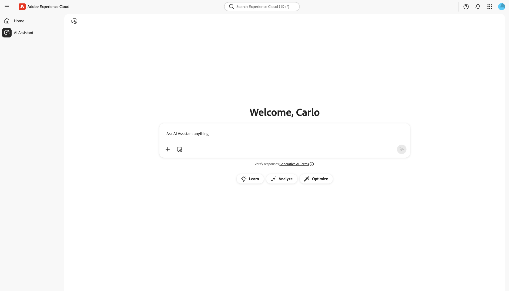
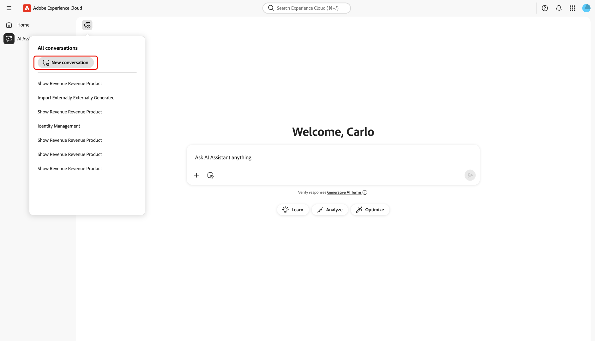

# Assistente IA

AI Assistant è uno strumento intelligente di intelligenza artificiale di tipo conversazionale che consente di aumentare la produttività e ridefinire il lavoro nelle applicazioni basate su Adobe Experience Platform. È possibile utilizzare l’Assistente IA per accedere agli agenti Adobe Experience Platform e ad altre funzionalità di intelligenza artificiale.

Leggi questa guida per scoprire come utilizzare l’Assistente AI.

## Accedere all’Assistente IA

Esistono diversi modi per accedere all’Assistente IA.

Nell&#39;interfaccia Home di Experience Cloud, seleziona **[!UICONTROL Assistente IA]** dal menu di navigazione a sinistra per avviare una visualizzazione a schermo intero dell&#39;Assistente AI.

+++Seleziona per visualizzare

+++

Puoi anche avviare l’Assistente IA dalle home page di applicazioni Experience Cloud come Experience Platform, Adobe Journey Optimizer e Customer Journey Analytics. Passa alla home page del prodotto, quindi seleziona l&#39;icona **Assistente IA** dall&#39;intestazione superiore per avviare il pannello chat dell&#39;Assistente IA nella barra a destra.

+++Seleziona per visualizzare

+++

## Navigare nell’interfaccia utente dell’Assistente IA

Leggi questa sezione per scoprire come navigare nell’interfaccia dell’Assistente AI.

### Visualizzazione a schermo intero

L’interfaccia di AI Assistant include diversi elementi chiave per aiutarti a interagire in modo efficace:

1. **[!UICONTROL Conversazioni]**: seleziona l&#39;icona **[!UICONTROL Conversazioni]** per avviare una nuova conversazione e accedere alle conversazioni recenti dalla cronologia. Per ulteriori informazioni, consulta la sezione sulle [conversazioni](#conversations).
2. **Casella di input**: selezionare la casella di input per immettere domande e richieste per l&#39;Assistente AI. Per ulteriori informazioni, leggere la sezione sulle [funzionalità di input](#input-features).
3. **Completamento automatico dati e oggetti**: - Selezionare l&#39;icona più per utilizzare i suggerimenti dati e oggetto e il completamento automatico. Se questa opzione è selezionata, è possibile utilizzare una finestra popup per selezionare le entità suggerite. Per ulteriori informazioni, leggere la sezione sul completamento automatico di [dati e oggetti](#autocomplete).
4. **Impostazione contesto**: - Selezionare l&#39;icona Impostazione contesto per configurare le origini di informazioni per l&#39;Assistente IA. Puoi utilizzare questo strumento per configurare l’applicazione, la sandbox e la visualizzazione dati a cui fa riferimento l’Assistente AI per rispondere alla query. Per ulteriori informazioni, leggere la sezione relativa all&#39;[impostazione del contesto](#context-setting).
5. **Individuazione**: - Selezionare **[!UICONTROL Scopri]**, **[!UICONTROL Analizza]** e **[!UICONTROL Ottimizza]** per visualizzare le query di esempio che è possibile utilizzare per iniziare. Per ulteriori informazioni, vedere la sezione relativa alle [richieste di individuazione](#discoverability-prompts).

### Vista a barre

La visualizzazione della barra consente di accedere rapidamente a chat, richieste di individuazione, aggiornamenti, conversazioni e controlli dell’interfaccia in un pannello compatto.

1. **[!UICONTROL Chat]**: seleziona **[!UICONTROL Chat]** dall&#39;intestazione per tornare alla conversazione nel caso in cui ti sia lasciato per accedere a diversi elementi nell&#39;interfaccia.
1. **[!UICONTROL Individuazione]**: selezionare **[!UICONTROL Individuazione]** per visualizzare un elenco di prompt dell&#39;Assistente IA organizzati per categoria. Puoi usare questi prompt preconfigurati per popolare la chat. Inoltre, puoi modificare i prompt suggeriti per soddisfare il tuo caso d’uso specifico.
1. **[!UICONTROL Novità]**: seleziona **[!UICONTROL Novità]** per visualizzare un elenco degli ultimi aggiornamenti disponibili per l&#39;Assistente di intelligenza artificiale.
1. **[!UICONTROL Conversazioni]**: seleziona l&#39;icona **[!UICONTROL Conversazioni]** per avviare una nuova conversazione e accedere alle conversazioni recenti dalla cronologia. Per ulteriori informazioni, consulta la sezione sulle [conversazioni](#conversations).
1. **Visualizzazione a schermo intero**: seleziona l&#39;icona **[!UICONTROL Visualizzazione a schermo intero]** per modificare l&#39;interfaccia dell&#39;Assistente AI dalla barra a destra alla modalità a schermo intero.
1. **Completamento automatico dati e oggetti**: selezionare l&#39;icona più per utilizzare i suggerimenti dati e oggetti e il completamento automatico. Se questa opzione è selezionata, è possibile utilizzare una finestra popup per selezionare le entità suggerite. Per ulteriori informazioni, leggere la sezione sul completamento automatico di [dati e oggetti](#autocomplete).
1. **Impostazione contesto**: selezionare l&#39;icona Impostazione contesto per configurare le origini di informazioni per l&#39;Assistente IA. Puoi utilizzare questo strumento per configurare l’applicazione, la sandbox e la visualizzazione dati a cui fa riferimento l’Assistente AI per rispondere alla query. Per ulteriori informazioni, leggere la sezione relativa all&#39;[impostazione del contesto](#context-setting).

## Guida all’interfaccia utente di Assistente IA

Questa sezione fornisce una panoramica delle funzioni principali e delle opzioni di navigazione nell’interfaccia utente di AI Assistant. Spiega come accedere all’Assistente AI, descrive il layout e i controlli sia nelle visualizzazioni a schermo intero che nelle visualizzazioni a barra, e introduce strumenti chiave come conversazioni, funzioni di input, completamento automatico, impostazione del contesto e prompt di individuazione. Le sezioni seguenti forniscono indicazioni dettagliate sull’utilizzo di queste funzioni per interagire con l’Assistente AI e ottenere il massimo dalla tua esperienza.

### Richieste di individuazione

È possibile utilizzare la funzione di individuazione dell&#39;Assistente IA per visualizzare un elenco dei soggetti generali, raggruppati in entità, supportati dall&#39;Assistente AI. I prompt di individuazione variano a seconda del punto iniziale.

>[!BEGINTABS]

>[!TAB Usa individuazione dalla visualizzazione a schermo intero]

Dalla visualizzazione a schermo intero, i prompt di individuazione sono raggruppati in tre categorie: **[!UICONTROL Scopri]**, **[!UICONTROL Analizza]** e **[!UICONTROL Ottimizza]**.

Per utilizzare le richieste di individuazione per migliorare la conoscenza del prodotto, selezionare **[!UICONTROL Scopri]**, quindi selezionare un prompt dalla finestra a discesa visualizzata.

>[!TAB Utilizza l&#39;individuazione dalla visualizzazione della barra]

Selezionare **[!UICONTROL Individuazione]** dalla visualizzazione della barra per accedere a un elenco completo di richieste di individuazione che è possibile utilizzare per iniziare e popolare la chat con l&#39;Assistente IA.

>[!ENDTABS]

Selezionare un prompt per compilare la casella di input. Da qui puoi modificare la richiesta in base al tuo caso d’uso specifico. Al termine dell’operazione, seleziona l’icona di invio a destra per inviare la query.

## Interazione con le risposte

### Verifica del processo di ragionamento {#reasoning}

L&#39;Assistente IA esegue quindi una query sulla knowledge base e calcola una risposta. Dopo alcuni istanti, l’Assistente AI restituisce una risposta, incluse opzioni per approfondire il processo di ragionamento, i suggerimenti correlati, le origini delle informazioni e gli strumenti di feedback.

Per comprendere meglio il processo di ragionamento sottostante, selezionare **[!UICONTROL Ragionamento completato]**.

La finestra *[!UICONTROL Motivazione completata]* si espande per visualizzare un riepilogo della richiesta e dettagli sulla modalità di creazione della risposta.

### Usa suggerimenti correlati

Quindi, passa alla parte inferiore della risposta e seleziona **[!UICONTROL Suggerimenti correlati]** per ricevere un elenco di richieste relative alla query iniziale. È possibile utilizzare queste richieste per continuare ulteriormente la conversazione con l&#39;Assistente AI.

### Visualizza origini

Per verificare la risposta dell&#39;Assistente AI, selezionare **[!UICONTROL Origini]** per visualizzare un elenco delle origini di informazioni a cui l&#39;Assistente AI fa riferimento durante il calcolo della risposta.

### Fornire feedback

Puoi fornire un feedback sulla tua esperienza con l’Assistente AI utilizzando le opzioni fornite con la risposta.

Per fornire un feedback, seleziona Miniature in alto o Miniature in basso dopo aver ricevuto una risposta da AI Assistant, quindi inserisci il tuo feedback nella casella di testo fornita.

>[!BEGINTABS]

>[!TAB Miniature in alto]

Seleziona **[!UICONTROL Miniatura]** per fornire un feedback positivo. Facoltativamente puoi effettuare una selezione da un elenco di feedback positivi o utilizzare la casella di immissione per inserire un feedback specifico.

+++Seleziona per visualizzare

Puoi anche selezionare **[!UICONTROL Feedback dettagliato]** per approfondire ulteriormente il tuo feedback. Al termine, selezionare **[!UICONTROL Invia]**.

+++

>[!TAB Miniature giù]

Seleziona **[!UICONTROL Miniature giù]** per fornire un feedback costruttivo. Facoltativamente, puoi scegliere da un elenco di feedback costruttivi o utilizzare la casella di immissione per inserire un feedback specifico.

+++Seleziona per visualizzare

Allo stesso modo, puoi anche selezionare **[!UICONTROL Feedback dettagliato]** per approfondire ulteriormente il tuo feedback. Al termine, selezionare **[!UICONTROL Invia]**.

+++

>[!ENDTABS]

### Utilizzare la funzione di visualizzazione divisa

Se la risposta dell&#39;Assistente AI include un&#39;immagine, è possibile selezionare l&#39;icona del percorso per avviare una modalità di visualizzazione divisa. Questo consente di leggere l’intera risposta di AI Assistant con l’immagine contestuale visualizzata a destra.

### Conversazioni

Puoi usare il pannello *[!UICONTROL Tutte le conversazioni]* per reimpostare e rivedere le conversazioni con l&#39;Assistente AI. Seleziona l&#39;icona **[!UICONTROL Conversazioni]** per visualizzare la finestra *[!UICONTROL Tutte le conversazioni]*.

Per rivedere una conversazione precedente, selezionare l&#39;argomento di conversazione dall&#39;elenco fornito.

Per avviare una nuova conversazione, selezionare **[!UICONTROL Nuova conversazione]**.

### Impostazione contesto {#context-setting}

Utilizza la funzione di impostazione del contesto di Assistente IA per configurare l&#39;**applicazione**, la **sandbox** e la **visualizzazione dati** a cui l&#39;Assistente IA fa riferimento per rispondere alla query. Per accedere all&#39;impostazione del contesto, selezionare l&#39;icona **[!UICONTROL Impostazione del contesto]** dalla casella di input.

Viene visualizzata la finestra popup *[!UICONTROL Risposta da...]*. Utilizzare questa finestra per configurare le origini informazioni da utilizzare, quindi selezionare **[!UICONTROL Imposta contesto]**.

| Origine delle informazioni | Descrizione | Esempi |
| --- | --- | --- |
| App | L’applicazione Experience Cloud a cui si riferisce la query. | Experience Platform, Journey Optimizer, Customer Journey Analytics, ecc. |
| Sandbox | La sandbox che contiene i set di dati o le informazioni a cui si riferisce la query. | Prod (VA7), Sviluppo |
| Visualizzazione dati | Quando si utilizza l’Assistente IA con Customer Journey Analytics, l’impostazione della visualizzazione dati aiuta Data Insights Agent a comprendere: <ul><li>Quali set di dati eseguire la query</li><li>Quali componenti dati sono disponibili</li><li>Come strutturare le risposte relative ai dati</li><li>Quali visualizzazioni creare in Analysis Workspace</li></ul> |

### Completamento automatico dati e oggetti

È possibile utilizzare la funzione di completamento automatico per ricevere un elenco di oggetti dati esistenti nella sandbox. Per utilizzare il completamento automatico, immettere l&#39;icona più (+) nella query. In alternativa, potete anche selezionare l&#39;icona più (+) situata nella parte inferiore della casella di immissione testo. Viene visualizzata una finestra con un elenco degli oggetti dati consigliati dalla sandbox.

### Verificare le risposte

Esistono diversi modi per verificare le risposte dell’Assistente IA. Selezionare **[!UICONTROL Termine di query corrispondente a oggetti]** per visualizzare un riepilogo dei termini della query corrispondenti a oggetti specifici dell&#39;organizzazione.

Seleziona **[!UICONTROL Ecco come ho ottenuto i risultati]** per vedere una spiegazione dettagliata di come l&#39;Assistente AI è arrivato alla sua risposta. È inoltre possibile visualizzare la query SQL eseguita per rispondere alla domanda. Questa query è di sola lettura e non è supportata per l&#39;utilizzo in Query Service.

### Configurare la visualizzazione dati

Puoi utilizzare le funzionalità di visualizzazione dei dati dell’Assistente AI per comprendere meglio i tuoi dati. È inoltre possibile specificare il tipo di grafico che si desidera utilizzare nella query. Ad esempio, inviare una query che indichi: **&quot;Mostra profitto per nome prodotto per ultimo mese (barra)&quot;** per ricevere un grafico a barre degli utili dell&#39;ultimo mese, organizzati per nome prodotto.

Quindi, seleziona **[!UICONTROL Proprietà]** per modificare il tipo di grafico e configurare i valori per l&#39;asse X e Y.

L’Assistente AI supporta diversi tipi di grafo per la visualizzazione dei dati. Puoi interagire con tutti i tipi di grafici passando il cursore sopra i dati.

>[!BEGINTABS]

>[!TAB Line]

Per visualizzare un grafico a linee, selezionare **[!UICONTROL Proprietà]**, quindi selezionare **[!UICONTROL Linea]**.

>[!TAB Area]

Per visualizzare un grafico a superficie, selezionare **[!UICONTROL Proprietà]**, quindi selezionare **[!UICONTROL Area]**.

>[!TAB A dispersione]

Per visualizzare un grafico a dispersione, selezionare **[!UICONTROL Proprietà]**, quindi selezionare **[!UICONTROL Dispersione]**.

>[!TAB Anello]

Per visualizzare un grafico ad anello, selezionare **[!UICONTROL Proprietà]**, quindi selezionare **[!UICONTROL Anello]**.

>[!ENDTABS]
